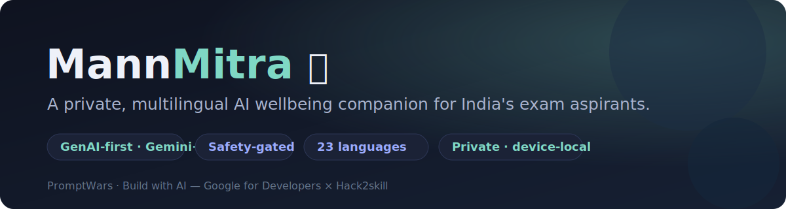
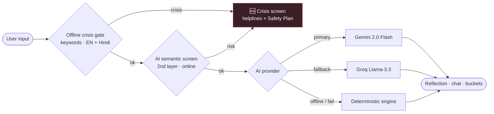
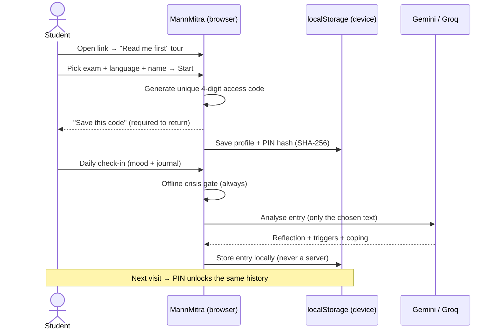
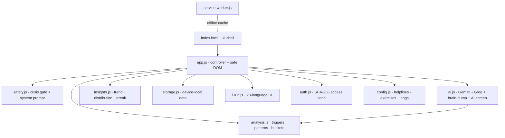

<p align="center">
  
</p>

<h1 align="center">🪷 MannMitra — your mind's quiet companion</h1>

<p align="center">
  <i>A private, multilingual, GenAI wellbeing companion for India's high-stakes exam aspirants.</i>
</p>

<p align="center">
  <a href="https://108tsrenukesh.github.io/MannMitra-AI/"></a>
  
  
</p>

<p align="center">
  
  
  
  
  
  
</p>

> Built for **PromptWars · Build with AI** (Google for Developers × Hack2skill).
> **Live:** https://108tsrenukesh.github.io/MannMitra-AI/

---

## 📑 Table of contents
- [Why MannMitra](#-why-mannmitra)
- [The defining insight](#-the-defining-insight)
- [Features](#-features)
- [How it works (GenAI + safety flow)](#-how-it-works)
- [User journey](#-user-journey)
- [Architecture](#-architecture)
- [Safety & Privacy](#-safety--privacy)
- [GenAI usage](#-genai-usage)
- [Tech stack](#-tech-stack)
- [Run locally](#-run-locally)
- [Deploy](#-deploy)
- [Testing](#-testing)
- [Roadmap](#-roadmap)
- [Disclaimer](#-disclaimer)

---

## 💡 Why MannMitra

India's competitive-exam students are in a silent mental-health crisis:

| Stat | Source |
|---|---|
| **14,488** student suicides in 2024 (≈8.5% of all suicides, +4.3% YoY) | NCRB |
| **Exam failure** = the **#1 recorded cause** for under-18s | NCRB |
| **>85%** of students report moderate-to-severe exam stress | NIMHANS |
| **~70% anxiety / ~60% depressive signs** during prep (8-city study) | 2025 study |
| Kota coaching-hub suicides: **28 → 17** (2023→24), rising in 2025 | Reported |

Counselling capacity can't scale to this. MannMitra is the **upstream, always-on, anonymous layer** that catches students early and bridges them to real human help.

## 🎯 The defining insight

> Among students who reach the point of suicidal thoughts, **fewer than 4 in 10 tell anyone — and those who do tell a friend, not a counsellor.** *(NIMHANS)*

So we didn't build a clinical app. We built the **private friend a student will actually confide in** — one that quietly bridges them to real help (Tele-MANAS & more), and never pretends to replace it.

## ✨ Features

| | Feature | What it does |
|---|---|---|
| 📝 | **Daily check-in** | Open journaling + 1-tap mood. The AI reflects back in 2–4 warm sentences and surfaces **hidden stress triggers**. |
| 🧠 | **Brain-dump summarizer** | Pour out a messy rant → AI sorts it into clear buckets (syllabus / rank / sleep). *Organises, doesn't diagnose.* |
| 💬 | **Companion chat** | Empathetic, exam- & language-aware coping support. Not a therapist — a friend who gets exam pressure. |
| 📈 | **Patterns** | Mood trend **with date & time**, distribution, streaks, a weekly *"pattern of the week,"* and a cloud of recurring themes. |
| 🧰 | **Adaptive toolkit** | Box / 4-7-8 / Ocean breathing (animated), grounding, PMR, **Rank-anxiety reframe** — auto-suggested to your state, **fully offline**. |
| 🎯 | **Exam mode** | Set your exam date → a gentle, paced countdown with stage-aware tips. |
| 🆘 | **SOS safety net** | Crisis gate + one-tap helplines + a private **Stanley-Brown Safety Plan**. |
| 🔐 | **Access-code login** | A unique 4-digit code is generated at onboarding; required to reopen your device-local history. |
| 🌐 | **23 languages** | 22 Eighth-Schedule languages + English — **GenAI-translated** UI, cached on device. |
| 📖 | **Read-me-first tour** | A welcome guide pops on first launch; reopen anytime via the **❔** button. |

## 🔧 How it works

GenAI-first, with a deterministic fallback so the deployed link **always** works — and a **safety gate that runs before any AI call** (offline keyword check + online AI second pass).



## 🧭 User journey



## 🏗️ Architecture

Zero-dependency, no-build static app. Modules with single responsibilities:



```
mannmitra/
├── index.html            # SPA shell (onboarding, 5 tabs, lock, crisis, settings)
├── manifest.json, service-worker.js, icons/   # installable PWA, offline shell
├── docs/banner.svg
├── assets/css/styles.css
└── assets/js/
    ├── config.js   safety.js   storage.js   analysis.js
    ├── insights.js ai.js       i18n.js      auth.js
    ├── app.js                  # controller (safe DOM, no innerHTML)
    └── app.test.js             # 21 unit tests
```

## 🛡️ Safety & Privacy

**Safety (because careless AI here causes harm — ~20% unsafe responses vs ~7% for humans; APA mandates crisis-escalation):**
- 🔴 **Crisis gate runs before every AI call** — on check-in, chat *and* brain-dump. Offline keyword detection (English + Hindi/Hinglish/Devanagari) **+** an online AI semantic second pass. On any risk → it **halts** and shows helplines + your Safety Plan, never counsels a crisis alone.
- 🧠 **Hardened system prompt** on every call: never give methods, never validate self-harm, never diagnose, always bridge to a human.
- 🆘 **Always-on SOS** + Tele-MANAS 14416 / iCall / Vandrevala / AASRA, one-tap dial.

**Privacy (the #1 thing this audience asks for):**
- 🔒 **Device-local & anonymous** — journals, moods, chat, safety plan live in your browser. **No server, no account.**
- 🔑 **No keys in source** — runtime entry or CI-secret injection, placeholder-guarded.
- 🛡️ **Strict CSP, zero `innerHTML`, zero inline handlers** — minimal XSS surface.
- 📵 No ads, no trackers, **never used to train AI.** Export & delete anytime.

## 🤖 GenAI usage

| Where | Model | Purpose |
|---|---|---|
| Journal reflection | Gemini 2.0 Flash → Groq Llama-3.3 | 2–4 sentence empathetic reflection + structured triggers/coping (JSON) |
| Companion chat | Gemini → Groq | Contextual, exam- & language-aware coping dialogue |
| Brain-dump | Gemini → Groq | Categorise a rant into themed buckets + one tiny step each |
| AI crisis screen | Gemini → Groq | Second-layer semantic risk detection on top of the offline gate |
| 23-language UI | Gemini → Groq | On-demand UI translation, cached locally |

If AI is unavailable, a **deterministic engine** keeps every feature working — so the link never breaks.

## 🧱 Tech stack


-F7DF1E?logo=javascript&logoColor=black)


No framework, no build step, no dependencies — pure HTML/CSS/ESM. Web Crypto for the access code, Service Worker for offline.

## 💻 Run locally

ES modules need HTTP (not `file://`):

```bash
python -m http.server 8000      # or:  npx serve -l 8000
# open http://localhost:8000  (Incognito recommended)
```

Add AI keys via **⚙️ Settings → AI keys** (kept in session memory only).

## 🚀 Deploy

Push to `main` → GitHub Actions builds & publishes to Pages. Set repo secrets `GEMINI_API_KEY` / `GROQ_API_KEY` to enable AI on the live build (otherwise it runs in offline mode).

## ✅ Testing

- **21 unit tests** (`assets/js/app.test.js`) — crisis classifier, triggers, patterns, insights, PIN hashing, brain-dump bucketing. Run in-browser via [`tests.html`](tests.html) or in Node.
- **19 headless end-to-end checks** (jsdom) — full flow: onboarding → access-code → check-in → AI reflection → insights → crisis gate.

## 🗺️ Roadmap

Responsibly deferred (needs a backend or clinical governance): clinical-grade crisis classifier + human-in-the-loop review, campus resource navigator, opt-in peer "buddies," voice brain-dump, RCT validation. *We deliberately did **not** fabricate "alumni topper" personas — survivorship-bias + parasocial risk.*

## ⚠️ Disclaimer

MannMitra is a **supportive companion, not a doctor or therapist** and not a medical device. In distress, please contact **Tele-MANAS 14416** (free, 24×7, India).

## 📄 License

MIT — see [LICENSE](LICENSE).
